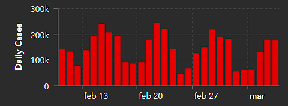
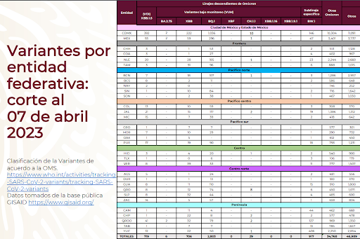
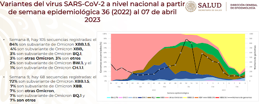

## Part 1

**Research: What is the current situation of COVID-19 worldwide, in
Mexico, in your home state, and in your municipality, borough, or
neighborhood? You can start your search on the Johns Hopkins University
COVID-19 dashboard or in national and local sources.**

According to data obtained from the Johns Hopkins Coronavirus Resource Center, in the last 38 days, there have been 4,035,234 new cases and 28,018 deaths globally. In Mexico, 82,596 new cases and 618 deaths have been reported. Similarly, in the state of Querétaro, 1,575 new cases and 16 deaths due to this disease have been registered. One of the main reasons for the high numbers of cases, despite the global and national measures taken during the past two years, is the existence of small spikes in infections that still occur during specific periods of time. 



**What was the first variant of the virus that spread worldwide?**

According to the Infectious Diseases Society of America, the term "ancestral strain" refers to the original version of a virus that was first generated. The ancestral strain of SARS-CoV-2 originated in Wuhan, China. However, the first variant of the virus, called the "Alpha" or "B.1.1.7" variant, emerged in December 2020 in England. This variant is categorized as a variant of concern due to its reported transmissibility, which was 46%-82% higher than the original strain.

**What other variants of the virus exist in different regions of the world?**

Globally, several SARS-CoV-2 variants have been identified, including:

Variants of Concern:

Alpha (B.1.1.7): First reported in England in December 2020.

Beta (B.1.351): First reported in South Africa in December 2020.

Gamma (P.1): First reported in Brazil in January 2021.

Delta (B.1.617.2): First reported in India in December 2020.

Omicron (B.1.1.529): First reported in South Africa in November 2021.

Variants of Interest:

Epsilon (B.1.427): First reported in the United States in June 2020.

Zeta (P.2): First reported in Brazil in April 2020.

Eta (B.1.525): First reported in New York in November 2020.

Iota (B.1.526): First reported in New York in November 2020.

Theta (P.3): First reported in the Philippines and Japan in February 2021.

Kappa (B.1.617.1): First reported in India in December 2021.

Lambda (C.37): First reported in Peru in June 2021.

Mu (B.1.621): First reported in Colombia in August 2021.

**How would you search for information about the variant of the virus in your country?**


In Mexico, various sources provide information on the change and current presence of SARS-CoV-2 variants in the nation. One of the most important sources is the Genomic Surveillance Report of the SARS-CoV-2 Virus in Mexico: National and State Distribution of Variants provided by the Government of Mexico. This report contains key information, such as the variants currently present by federal entity, as well as their presence since epidemiological week 36 (2022). 

**Imagine you are in a situation similar to that of Li Wenliang, the Chinese doctor who tried to alert about the coronavirus outbreak in his country but was detained by authorities and forced to retract. What would you do in his case? Select an option: a) Report it to a research center or university, b) Report it to the press, c) Keep the information.**

In a hypothetical situation similar to that of Dr. Li Wenliang, I believe the most objective action would be to report it to a local or national research center or the educational institution I am part of. Keeping the information would pose a danger by withholding valuable information that could contribute to better preparation and preventive measures against the spread of the SARS-CoV-2 virus.

On the other hand, directly reporting the findings to the press might result in the discovery not being taken seriously due to the lack of institutional or organizational support, being downplayed to avoid economic and social disruptions, or being exaggerated, further affecting public health and the economy.

I believe that with the support and representation of a research center or university, the probability of objectively and realistically sharing the findings about the SARS-CoV-2 virus would increase significantly. This approach would minimize the negative impact on the economy and society while benefiting the ecological sector by preventing panic buying and gradually reducing industrial pollution.

\newpage

## Part 2

**Sequences of SARS-CoV-2 Variants**

```{r, echo=FALSE, message = FALSE}
library("seqinr")
library("Biostrings")
library("ggplot2")

tamSeq = function(l){
  count = 0
  for(i in 1:length(l)){
    count = count +1
  }
  return(count)
}

seqv = function(l){
  a = DNAStringSet(l)
  b = toString(a)
  c = s2c(b)
  c
}

graficar = function(seq, name){
  df = data.frame(seq)
  p = ggplot(data=df, aes(x=seq, fill= seq))+ geom_bar() + geom_text(stat='count', aes(label=..count..), vjust=-1)
  p + labs(title =name, x ="Nucleotides", y = "Count") +
    theme(plot.title = element_text(hjust = .5))
}

GC = function(l){
  
  letras = c("A", "T", "G", "C")
  lista = numeric(0)
  for(i in 1:length(letras)){
    count = 0
    for(j in 1:length(l)){
      if(letras[i]== l[j]){
        count = count + 1
      }
    }
    amount = 100*count/length(l)
    lista[i] = amount
  }
  print(paste("GC Percentage: ",lista[3]+lista[4]))
}

reverse = function(l){
  a = character(length(l))
  for (i in 1:length(l)){
    a[i] = l[length(l)+1-i]
  }
  return(a)
}

examen = function(l,name){
  seq = seqv(l)
  tam = tamSeq(seq)
  print(paste("Size: ", tam))
  GCseq = GC(seq)
  revseq = reverse(seq)
  print("Reverse sequence (first 20 elements): ")
  print(revseq[1:20])
  graficar(seq,name) 
}
```

**Alpha Variant (B.1.1.7):**

```{r,echo=FALSE, message = FALSE,warning=FALSE}
variante_alpha = readDNAStringSet("variante_alpha.fasta")
examen(variante_alpha, "Coronavirus Alpha Variant")
```

\newpage

**Variante Beta (B.1.351):**

```{r,echo=FALSE, message = FALSE,warning=FALSE}
variante_beta = readDNAStringSet("variante_beta.fasta")
examen(variante_beta, "Coronavirus Beta Variant")
```

\newpage

**Variante Delta (B.1.617.2):**

```{r,echo=FALSE, message = FALSE,warning=FALSE}
variante_delta = readDNAStringSet("variante_delta.fasta")
examen(variante_delta, "Coronavirus Delta Variant")
```

\newpage

**Variante Epsilon (B.1.427):**

```{r,echo=FALSE, message = FALSE,warning=FALSE}
variante_epsilon = readDNAStringSet("variante_epsilon.fasta")
examen(variante_epsilon, "Coronavirus Epsilon Variant")
```

\newpage

**Variante Eta (B.1.525):**

```{r,echo=FALSE, message = FALSE,warning=FALSE}
variante_eta = readDNAStringSet("variante_eta.fasta")
examen(variante_eta, "Coronavirus Eta Variant")
```

\newpage

**Variante Iota (B.1.526):**

```{r,echo=FALSE, message = FALSE,warning=FALSE}
variante_iota = readDNAStringSet("variante_iota.fasta")
examen(variante_iota, "Coronavirus Iota Variant")
```

\newpage

**Variante Kappa(B.1.617.1):**

```{r,echo=FALSE, message = FALSE,warning=FALSE}
variante_kappa = readDNAStringSet("variante_kappa.fasta")
examen(variante_kappa, "Coronavirus Kappa Variant")
```

\newpage

**Variante Mu(B.1.621):**

```{r,echo=FALSE, message = FALSE,warning=FALSE}
variante_mu = readDNAStringSet("variante_mu.fasta")
examen(variante_mu, "Coronavirus Mu Variant")
```

\newpage

**Variante Omicron (B.1.1.529):**

```{r,echo=FALSE, message = FALSE,warning=FALSE}
variante_omicron = readDNAStringSet("variante_omicron.fasta")
examen(variante_omicron, "Coronavirus Omicron Variant")
```

\newpage

**Variante Tau (BA.2.75)):**

```{r,echo=FALSE, message = FALSE,warning=FALSE}
variante_tau = readDNAStringSet("variante_tau.fasta")
examen(variante_tau, "Coronavirus Tau Variant")
```

\newpage

**Variante Zeta(P.2):**

```{r,echo=FALSE, message = FALSE,warning=FALSE}
variante_zeta = readDNAStringSet("variante_zeta.fasta")
examen(variante_zeta, "Coronavirus Zeta Variant")

```

\newpage

When comparing the DNA base graphs for each of the virus variants, it is visually evident that the degree of variation in the bases of the variants is quite similar, with maximum GC percentage differences of approximately 8.48% between the most distinct variants. This, supported by the similar base proportions across variants, indicates they are very similar to one another. However, it is considered that more precise data could be obtained by determining the content of the unknown "N" bases.

\newpage

## References

COVID-19 Map - Johns Hopkins Coronavirus Resource Center. (n.d.). Johns Hopkins Coronavirus Resource Center. Retrieved from:
<https://coronavirus.jhu.edu/map.html>

SARS-CoV-2 Variants. (2023, April 11). Retrieved from:
<https://www.idsociety.org/covid-19-real-time-learning-network/emerging-variants/emerging-covid-19-variants/#>:\~:text=Ancestral%20strain%3A%20The
%20original%20form,%E2%80%9D%20or%20%E2%80%9CWuhan%E2%80%9D%20strain.

Aleem A, Akbar Samad AB, Vaqar S. Emerging Variants of SARS-CoV-2 And
Novel Therapeutics Against Coronavirus (COVID-19). 2023 Feb 5. In:
StatPearls [Internet]. Treasure Island (FL): StatPearls Publishing; 2023
Jan--. PMID: 34033342.Retrieved from:
<https://pubmed.ncbi.nlm.nih.gov/34033342/>
<https://coronavirus.gob.mx/variantes-covid-19/>
